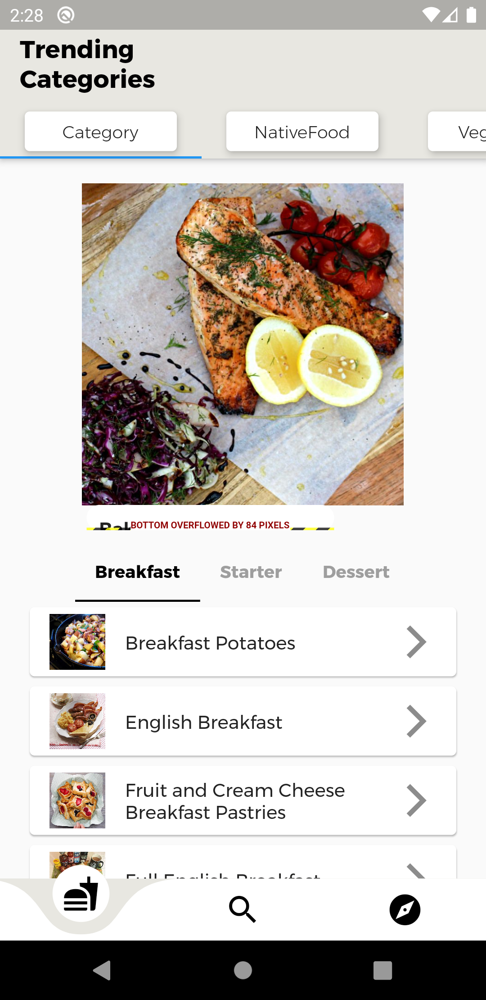
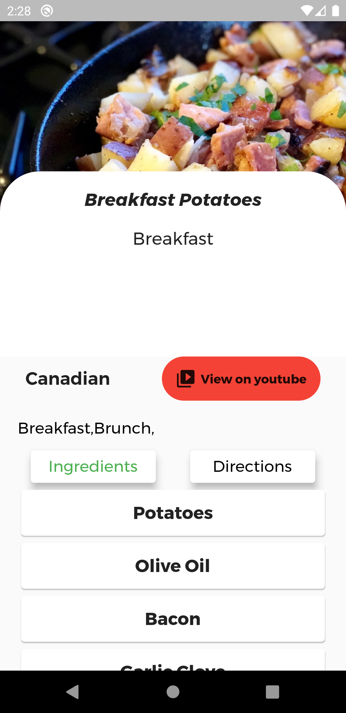
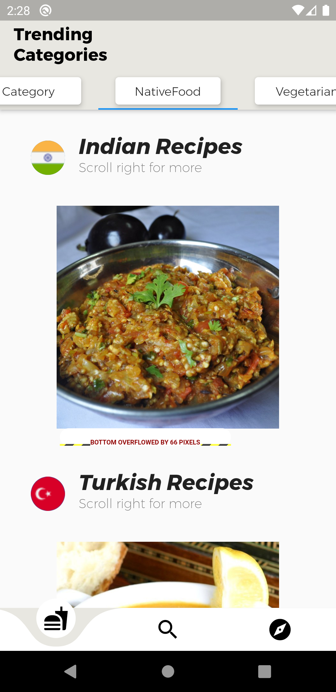
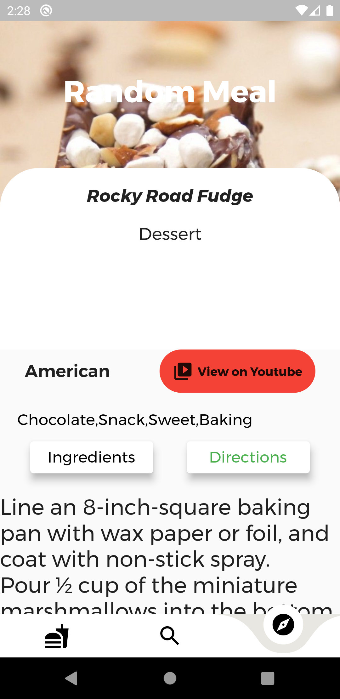

# easyrecipe

A beautiful recipes app with flutter and mealdb api. Clean design and perfect backend

## Full Details

* Users get three categories of food . Seafood, native food and vegetarian
* Users get also breakfast, starter and dessert recipes
* Users can click on a recipe and they get full details about it. 
* The Details are ingredients, directions, youtube video, category, image , drink and tags
* There is one page where a user gets a random recipe
* The other page is where users gets food  from india, turkey and usa
* The search page is still under development
* Api used was mealdb api

## Screenshots

  
 

